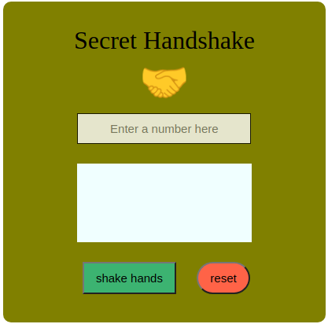

# secret-handshake project
This project is all about converting a number into the appropriate series of events which are: wink, double blink, close your eyes and jump with these numbers first changed to binary before application.

## Built with
- HTML
- CSS
- JavaScript
### Prerequisistes
knowlegde about:
- HTML
- CSS
- JavaScript
- Google chrome
### Clone project
- Get a local copy of the project by following these steps.
- Clone the repository with `git@github.com:Nathanael-Lontsi/secret-handshake.git` using your terminal.
## Steps
- $ `git@github.com:Nathanael-Lontsi/secret-handshake.git`
- $ `cd handshake`
- $ `git checkout feature/content`
## Start App
- run by opening the index.html in the browser
## Author
:bust_in_silhouette: **Nathanael-Lontsi**
-GitHub: [@Nathanael-Lontsi](https://github.com/Nathanael-Lontsi/secret-handshake)
## :hanshake: contributing
Contributions, issues and feature requests are welcome!
Feel free to check the [issues page](https://github.com/Nathanael-Lontsi/secret-handshake/issues).
## :memo: license
This project is [rebaseacademy](./LICENSE) licensed.